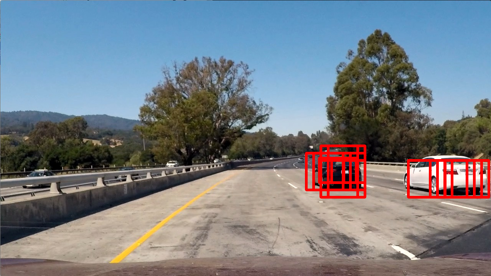
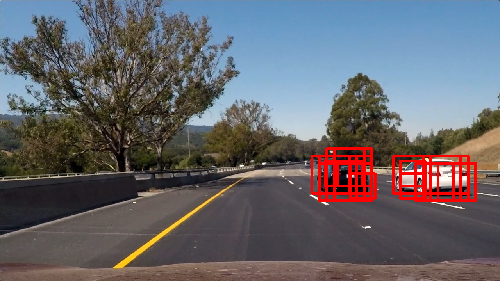

# **Vehicle Detection Project**

The goals / steps of this project are the following:

* Perform a Histogram of Oriented Gradients (HOG) feature extraction on a labeled training set of images and train a classifier Linear SVM classifier
* Optionally, you can also apply a color transform and append binned color features, as well as histograms of color, to your HOG feature vector. 
* Note: for those first two steps don't forget to normalize your features and randomize a selection for training and testing.
* Implement a sliding-window technique and use your trained classifier to search for vehicles in images.
* Run your pipeline on a video stream (start with the test_video.mp4 and later implement on full project_video.mp4) and create a heat map of recurring detections frame by frame to reject outliers and follow detected vehicles.
* Estimate a bounding box for vehicles detected.

## [Rubric](https://review.udacity.com/#!/rubrics/513/view) Points

### Here I will consider the rubric points individually and describe how I addressed each point in my implementation.  

---

All code is contained in [vehicle\_classifier.py](./vehicle_classifier.py), [vehicle\_detection.py](./vehicle_detection.py) and [detection\_helpers.py](./detection_helpers.py)

### Histogram of Oriented Gradients (HOG)

I started by reading in all the 'vehicle' and 'non-vehicle' images from the datasets provided by Udacity (GTI, KITTI, and extra). This can be found on lines 13-16 of vehicle\_classifier.py. The features of each image are then extracted by lines 33-46, which use the extract\_features function defined on lines 72-96 of detection_helpers.py. This function allows the adjustment of many parameters, including whether or not to use certain types of data for classification.

To get the HOG features specifically, it calls 'get\_hog\_features' which is defined on lines 31-40 of detection\_helpers.py.

I explored different color spaces and different 'skimage.hog()' parameters ('orientations', 'pixels\_per\_cell', and 'cells\_per\_block'). I tested this both in the classifier as well as how useful the resulting classifier was in detecting vehicles in the test video. Since my classifier saves the resulting model and scaling algorithm (vehicle_classifier.py lines 78-79), I was able to train/test on the entire dataset and tweak the video pipeline parameters using the trained model sepparately.

I tried various combinations of parameters and color spaces, including turning on and off different types of data. I found that using only the HOG with the YUV colorspace and histogram of the HSV colospace produced a high test accuracy for the classifier but didn't seem to be overfitting, giving good results on the video pipeline. Exact parameters can be found at lines 98-110 of detection_helpers.py. I also used results of applying the window finding to the test images to determine the best parameters.

#### 3. Describe how (and identify where in your code) you trained a classifier using your selected HOG features (and color features if you used them).

I trained a linear SVM using my parameters for feature extraction from above and the entire dataset provided by Udacity (vehicle_classifier.py lines 48-76). It splits 20% of the data for a test set, and it achieves over 99% accuracy on the test set. It also classifies fairly quickly, taking less than a minute to train and predict on the data provided.

---

### Sliding Window Search

#### 1. Describe how (and identify where in your code) you implemented a sliding window search.  How did you decide what scales to search and how much to overlap windows?

The slide_window, draw_boxes, and search_windows functions on lines 21-100 of vehicle_detection.py are used to slide windows across the image looking for matches to the trained classifier. Lines 193-206 of vehicle_detection.py then provide the parameters for windows sizes and areas to search on the image, as well as define the set of windows to search using those parameters. I decided to use a lot more overlap for the large windows to allow them a better chance of capturing a car or parts of a car, while I used less overlap for medium windows and none for the smallest window size. I also decided to concentrate the small windows towards the top of the overall search area, as they ought to be looking for vehicles that are farther away (towards the vanishing point), and larger windows are more concentrated towards the bottom of the search area.

#### 2. Show some examples of test images to demonstrate how your pipeline is working.  What did you do to optimize the performance of your classifier?

The result of the pipeline produces many overlapping detections on the cars, which will work well for my video pipeline which will use a heat map and multi-frame detection. The code to process test images can be found on lines 211-234 of vehicle_detection.py. The results on images can be seen below:

<table>
  <tr>
    <th>Original Image</th>
	<th>Processed Image</th>
  </tr>
  <tr>
    <td></td>
    <td></td>
  </tr>
  <tr>
    <td></td>
    <td></td>
  </tr>
</table>

---

### Video Implementation

#### 1. Provide a link to your final video output.  Your pipeline should perform reasonably well on the entire project video (somewhat wobbly or unstable bounding boxes are ok as long as you are identifying the vehicles most of the time with minimal false positives.)

Here's a [link to my video result](./project_output.mp4). And [here's a youtube link](https://youtu.be/i398ie0THQg)

#### 2. Describe how (and identify where in your code) you implemented some kind of filter for false positives and some method for combining overlapping bounding boxes.

I recorded the positions of positive detections in each frame of the video and stored them in an accumulator within my video processor object (vehicle\_detection.py, lines 240-270). From the positive detections I created a heatmap and then thresholded that map to identify vehicle positions. I then used `scipy.ndimage.measurements.label()` to identify individual blobs in the heatmap. I then assumed each blob corresponded to a vehicle. I constructed bounding boxes to cover the area of each blob detected. The heatmap, labelling, and box aggregation code can be found on lines 169-191 of vehicle_detection.py.

This method allows both the combining of overlapping bounding boxes including the overlap across frames, as well as a large reduction in false positives which aren't often detected over multiple frames.

---

### Discussion

#### 1. Briefly discuss any problems / issues you faced in your implementation of this project.  Where will your pipeline likely fail?  What could you do to make it more robust?

My pipeline works fairly well, but detects the yellow lane line early on in the video for a few frames and loses the whit car when it gets a bit far away. I could further adjust the classifier by adding in more information in the form of color spatial bins, or I could possibly use a different colorspace for HOG or color histogram parameters. This might help reduce false positives and track vehicles better.